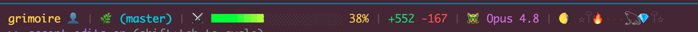

<div align="center">

# 📖✨ Grimoire Ex Machina ✨📖

### *where machines remember*

**A personal knowledge graph that runs on local models —<br>knows everything, costs nothing, and is slightly unhinged.**

<br>


<br>

<!-- generated locally: `grim vision cast mascot-banner` (A1111) -->


<sub>🤖📖 the Grimoire Roboticus — brass automaton wizards channelling living spellbooks</sub>

</div>

---

## ✨ What it does


- Extracts structured entities from your unstructured notes (diary, meetings, docs)
- Links them with typed relationships (works_on, depends_on, collaborates_with)
- Maintains itself autonomously via a nightly ritual
- Gives AI assistants (Claude Code, etc.) persistent memory across sessions via MCP
- Supports personas (specialized AI behaviors) and cheat codes (lessons learned)

All data is **JSON files on disk** — no database, no external services. AI runs on local Ollama models.

---

## 🏛️ Architecture

```
grimoire/          Engine (this repo — public)
  bin/             CLI scripts
  lib/             Shared utilities
  docs/            Setup guides

grimoire-kb/       Knowledge base (separate private repo)
  entities/        JSON entity files (people, projects, concepts, events, ...)
  indexes/         Generated — graph.json (gitignored)
  logs/            Nightly ritual logs (gitignored)
```

The engine and KB are separate repos. The engine points at the KB via `GRIMOIRE_ROOT`.

---

## 📜 Commands — the spellbook

```
grim scribe            Rebuild graph index + vector embeddings   (The Scribe)        [local]
grim oracle            Search the KB — keyword + semantic hybrid  (The Oracle)        [local + remote]
grim crawl             Extract entities from notes/docs           (The Crawl)         [local]
grim divine            Validate graph health                      (Divination)        [local + remote]
grim pathfind          Link orphan entities via Rebel + Ollama    (Pathfinder)        [local]
grim rest              Long Rest deep analysis                    (Long Rest)         [local]
grim archaeologist     Catalog old code projects into KB          (The Archaeologist) [local + remote]
grim vision cast       Generate images via AUTOMATIC1111          (The Vision)        [local + remote]
grim vision interrogate  CLIP-caption images → entity hints       (The Vision)        [local + remote]
grim load              Load save — begin a session                (SAVESTATE)         [local + remote]
grim save              Write save — end a session                 (SAVESTATE)         [local + remote]
grim tome              Memory ops: recall/remember/relate         (The Tome)          [local + remote]
grim mm                Read/write the .mm pact thread             (The Postbox)       [any cwd]
grim serve             Start HTTP + MCP server                                        [run on grimoire.local]
```

**Local** commands require `GRIMOIRE_ROOT` set and the KB directory accessible.
**Remote** commands require `GRIMOIRE_HOST` pointing at a running `grim serve`.

---

## 🕸️ Cluster & Harness Integration

Grimoire is designed to run on a central host (currently `grimoire.local`) while clients on various boxes in the network clone the engine and connect remotely. Each client maintains its own copy of the engine and skills, allowing you to tailor AI behavior per machine or project.

- **Skills Hub**: Add or modify skills in `plugin/skills/` on any host. These are version-controlled and shared across the cluster.
- **Harness Slots**: AI harnesses (Claude Code, Copilot, etc.) consume skills via symbolic links or configuration files. Create a slot in your harness config that points to `plugin/skills/<skill-name>/SKILL.md`.
- **Per-Harness Config**: Keep harness-specific files (e.g., `.claude/settings.json`) in a dedicated directory in your home folder. Link or symlink these into your harness's expected locations as needed — keeps harness configs separate from the repo and portable.
- **Remote Ontology**: Regardless of the client box, AI assistants connect to the central KB on `grimoire.local` via `GRIMOIRE_HOST` to search, track, and update the shared ontology. This ensures consistent context across all projects and tools.

---

## 🚀 Quick start (on grimoire.local)

```bash
git clone <this-repo> grimoire
git clone <kb-repo>   grimoire-kb

cd grimoire
npm install
cp .env.example .env
# Edit .env: set GRIMOIRE_ROOT to your grimoire-kb path

# Build the graph index
grim scribe

# Search
grim oracle "your query"

# Start server for LAN clients + Claude Code MCP
grim serve
```

---

## ⚙️ Environment

| Variable | Default | Description |
|----------|---------|-------------|
| `GRIMOIRE_ROOT` | — | Path to grimoire-kb directory (local mode) |
| `GRIMOIRE_HOST` | — | Grimoire server URL, e.g. `http://grimoire.local:3663` (remote mode) |
| `OLLAMA_HOST` | `http://grimoire.local:11434` | Ollama base URL |
| `GRIMOIRE_PORT` | `3663` | Port for `grim serve` |
| `GRIMOIRE_NER_HOST` | `http://grimoire.local:3773` | NER service (GLiNER + Rebel) |
| `GRIMOIRE_A1111_HOST` | `http://grimoire.local:7860` | AUTOMATIC1111 Stable Diffusion |
| `GRIMOIRE_EMBED_MODEL` | `nomic-embed-text` | Ollama embedding model |

---

## 🧠 AI model routing

All AI operations use local Ollama models — no cloud required.

| Task | Model |
|------|-------|
| Entity extraction, linking, analysis | Qwen3 (~35B A3B) |
| Rumination / noise floor | Qwen3 (~35B A3B) |
| Interactive reflection | Qwen3 (~35B A3B) |

The default is **Qwen3 35B A3B** (`qwen3` family) for essentially everything — dense reasoning at sparse-MoE cost. Models are resolved dynamically via `grim models` — routing uses installed models scored against capability profiles. Run `grim models` to see the current routing table for your hardware.

---

## 🎭 Personas

Grimoire ships with five personas — specialized AI behavior modes:

| Name | Domain | Activates on |
|------|--------|-------------|
| GLITCH | Code review | "review", "open-pr", "pre-commit" |
| THE CRAWLER | Knowledge mining | "ingest", "extract entities", "crawl" |
| SAVESTATE | Memory / sessions | "load save", "write save", "resume" |
| GM | Architecture / reasoning | "architecture", "design", "tradeoffs" |
| LOREKEEPER | Documentation | "document", "readme", "explain" |

---

## 🔌 Service ports

| Port | Service |
|------|---------|
| 3663 | Grimoire HTTP + MCP server |
| 3773 | NER service (GLiNER + Rebel) |
| 7860 | AUTOMATIC1111 |
| 11434 | Ollama |

Open port **3663** on grimoire.local for LAN clients. See [docs/client-setup.md](docs/client-setup.md).

---

## ⚔️ The Pact — minion / mage / hierophant

For non-trivial implementation work, Grimoire splits the job across separate Claude Code sessions running in the **same working directory**. It's a three-layer pact — use as many layers as the work needs (most work only needs the bottom two):

| Role | Session | Job |
|------|---------|-----|
| **Minion** 🧎 | Local or cloud (the hands) | Reads the brief, implements *exactly* what it says, reports back. Never self-approves. |
| **Mage** 🧙 | Cloud model (tech lead) | Plans phases, writes briefs, reviews reports verify-don't-trust, issues verdicts. Never implements. |
| **Hierophant** 🔮 | Cloud (the authority) | Sets the cross-phase roadmap, drafts briefs, answers architecture questions, mediates a stalled loop. Mediates by exception. |

The sessions never talk directly — they pass messages through `.mm/`, an append-only directory of markdown files that is gitignored and stays local.

### The Postbox (`grim mm`)

The sessions **never touch `.mm/` by hand** — all the fiddly mechanics (creating the dir, gitignoring it, the session→role marker the status line reads, message numbering, the `phase · state` header, working out what's unread) live in one command so the model spends its attention on judgment, not bookkeeping:

```bash
grim mm read  --role minion --session "$CLAUDE_CODE_SESSION_ID"          # what's unread for me?
grim mm read  --role hierophant --session "$ID" --all                    # whole thread, cold start
grim mm write --role mage --session "$ID" --state revise --phase 3 --file fixes.md
```

`read` prints only the messages a role should act on (the minion hears the mage; the mage hears the minion below and the hierophant above) and tells you whose move it is. `write` refuses to double-send while you're waiting on a reply, and stamps the next sequence number and header for you.

### Message convention

A single global counter, one file per message — **not** paired numbers:

```
.mm/
  0001-mage.md      ← brief / kickoff (points at plans/phase-N.md)
  0002-minion.md    ← report (counts are pasted command output, never hand-tallied)
  0003-mage.md      ← verdict: accepted, or revise with numbered fixes
  0004-mage.md      ← on accepted: the next phase's brief (a legitimate back-to-back)
  ...
```

Every file starts with: `phase: <N> · state: <state>`, where `state` is one of
`brief · report · revise · accepted · question · blocked · direction · escalate`.

**`accepted` is terminal** — it closes a phase and owes no reply. To the author (`grim mm read` says *YOUR MOVE*) that means: archive the thread, then either brief the next phase or call the engagement done. To everyone else it reads *IDLE* — wait for the next brief, don't go spelunking. (An `accepted` with no follow-up brief is the classic deadlock; the Postbox is built to make the follow-up the obvious next move.)

### Usage

```
[Mage]      /mage "start Phase 5 — implement the event bus"   ← kick off
            /mage                                             ← read latest, review, respond
[Minion]    /minion                                           ← check inbox and execute
[Hierophant] /hierophant                                      ← set roadmap / mediate a stall
```

When unresolved (repeated revise↔report on one point, or a `blocked` the mage can't settle), the mage `escalate`s and you summon the `/hierophant`.

### The HUD

The bundled status line (`deploy/claude-statusline.js`) turns each Claude Code window into a dungeon HUD: a bold-yellow repo name, a session-role glyph, a live pact-state glyph read from `.mm/`, an RGB green→yellow→red context-depth bar (🕯️→⚔️→💀→☠️ as the compaction reaper nears), code velocity, the model, and an animated torchlit corridor where a critter scuttles under a cycling moon.

The pact glyph is the tell: **⏳** waiting on a reply vs **🛠️** your move / work to do — with terminal states inverted so an `accepted` reads correctly on both sides (mage 🛠️ owes the next brief, minion ⏳ idle).

| | |
|---|---|
|  | **🗡️ Lone adventurer** — no pact; a solo session. Wandering glyph cycles each render. |
|  | **🧙 Mage** on `trader-mo` — running the per-phase loop. |
|  | **⏳ Waiting** — own message is latest; the ball is in the other session's court. |

Install it on any box with this repo checked out:

```bash
ln -s "$PWD/deploy/claude-statusline.js" ~/.claude/statusline.js
# then in ~/.claude/settings.json:
#   "statusLine": { "type": "command", "command": "node ~/.claude/statusline.js" }
```

Zero dependencies; needs a truecolor terminal for the gradient. Set `GRIM_ROLE=mage|minion|hierophant` to pin a role, or let the `/mage` `/minion` `/hierophant` skills drop the marker.

### Why this pattern works

- Each layer's context stays focused on its own job — design, implementation, or architecture — not the others' noise
- The minion's scope is bounded by the brief — it can't drift or gold-plate
- The `.mm/` thread is the audit trail for every decision in a phase
- Verdicts require re-running the test suite, not trusting green checkmarks

See `plugin/skills/{minion,mage,hierophant}/SKILL.md` for the full protocol and `bin/grim-mm.js` for the Postbox mechanics.

---

## 🧭 New machine setup

See [docs/client-setup.md](docs/client-setup.md) for full instructions including:
- Hosts file configuration (`grimoire.local` resolution)
- `.env` setup for remote mode
- Claude Code MCP configuration
- Firewall setup on grimoire.local

---

<div align="center">


### 🕯️ *Grimoire Ex Machina* 🕯️
**where machines remember**

<sub>local-first · zero-cloud · slightly unhinged</sub>

</div>
